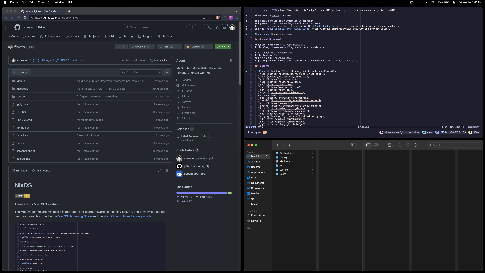

# NixOS/macOS Flake

[](https://opensource.org/licenses/MIT)

> "A man and his tools make a man and his trade"
>
> -Vita Sackville-West

> "We shape our tools and then the tools shape us"
>
> -Winston Churchill

These are my NixOS/macOS Nix setup.

| NixOS                                                     | macOS                                                   |
| --------------------------------------------------------- | ------------------------------------------------------- |
|  |  |

## Common Features

- User environment and dotfiles management with
  [`home-manager`](https://github.com/nix-community/home-manager).
- CLI-ready workflow with
  [`fish`](https://github.com/fish-shell/fish-shell),
  [`tmux`](https://github.com/tmux/tmux),
  [`zellij`](https://zellij.dev),
  [`git`](https://git-scm.com/),
  [`fish`](https://fishshell.com/),
  [`gpg`](https://gnupg.org/),
  [`ssh`](https://www.openssh.com/),
  [`curl`](https://curl.se/),
  [`rsync`](https://rsync.samba.org/),
  and power tools like
  [`bat`](https://github.com/sharkdp/bat),
  [`zoxide`](https://github.com/ajeetdsouza/zoxide),
  [`bottom`](https://clementtsang.github.io/bottom),
  [`fzf`](https://github.com/junegunn/fzf),
  [`yazi`](https://yazi-rs.github.io/),
  [`ripgrep`](https://github.com/BurntSushi/ripgrep),
  [`jq`](https://jqlang.github.io/jq/),
  [`just`](https://just.systems/),
  [`lazygit`](https://github.com/jesseduffield/lazygit),
  [`lazydocker`](https://github.com/jesseduffield/lazydocker),
  [`gh`](https://cli.github.com/),
  [`gh-dash`](https://github.com/dlvhdr/gh-dash),
  and more...
- Developer-ready languages:
  [Nix](https://nixos.org/),
  [Rust](https://rust-lang.org/),
  [Lua](https://lua.org),
  [Python](https://python.org/),
  and [Julia](https://julialang.org).
- Easy to develop environments with
  [`nix-shell`](https://nixos.org/manual/nix/stable/command-ref/nix-shell.html)
  [`direnv`](https://direnv.net/),
  and [`devshell`](https://numtide.github.io/devshell/).
  You can put your [soydev](https://storopoli.io/2023-11-10-2023-11-13-soydev/)
  TypeScript/JavaScript/NodeJS stuff here.
  Check the [recipes for several Nix shells](https://gist.github.com/storopoli/97e6f0b2e177722fcb3b7fbe5275fbe5).
- Text editor with [Vim](https://www.vim.org/)/[NeoVim](https://neovim.io)
  and [Helix](https://helix-editor.com) enabled with the following
  [LSP](https://langserver.org/)s:

  - [`nil`](https://github.com/oxalica/nil): Nix
  - [`bash-language-server`](https://github.com/bash-lsp/bash-language-server): Bash, Fish, Zsh, shell scripts, etc.
  - [`rust-analyzer`](https://rust-analyzer.github.io/): Rust
  - [`taplo`](https://taplo.tamasfe.dev/): TOML
  - [`yaml-language-server`](https://github.com/redhat-developer/yaml-language-server): YAML
  - [`pyright`](https://github.com/microsoft/pyright): Python
  - [`ruff-lsp`](https://github.com/astral-sh/ruff-lsp): Python
  - [`marksman`](https://github.com/artempyanykh/marksman): Markdown
  - [`vscode-langservers-extracted`](https://github.com/hrsh7th/vscode-langservers-extracted): HTML, CSS, and JSON
  - [`typst-lsp`](https://github.com/nvarner/typst-lsp): [Typst](https://typst.app)

- [Catppuccin](https://catppuccin.com) Mocha theme everywhere.
- Archival tools:
  [`gzip`](https://www.gnu.org/software/gzip/),
  [`xz`](https://tukaani.org/xz/),
  `zip`,
  [`lz4`](https://github.com/lz4/lz4),
  [`p7zip`](https://7-zip.org/),
  and [`zstd`](https://facebook.github.io/zstd/).
- CLI entertainment tools:
  [`yt-dlp`](https://github.com/yt-dlp/yt-dlp),
  [`termusic`](https://github.com/tramhao/termusic),
  and [`ffmpeg`](https://ffmpeg.org/).
- Publishing and content CLI tools:
  [`qpdf`](https://github.com/qpdf/qpdf),
  [`pandoc`](https://pandoc.org/),
  [`graphicsmagick`](http://www.graphicsmagick.org/),
  [`tectonic`](https://tectonic-typesetting.github.io/),
  and [`typst`](https://typst.app/).
- `age`-encrypted secrets with [`ryantm/agenix`](https://github.com/ryantm/agenix)
  with YubiKey support.
  Check the [`secrets/README.md`](secrets/README.md) for details.
- Apps:

  - [`firefox`](https://www.mozilla.org/firefox)
    with [Tor Browser](https://www.torproject.org/)
    also available
  - Bitcoin tools such as [Sparrow wallet](https://sparrowwallet.com/)
    and [Bisq](https://bisq.network/)
  - Encrypted backup tool with [Cryptomator](https://cryptomator.org/)
  - [Signal messenger](https://signal.org/)
  - Torrenting with [Transmission](https://transmissionbt.com/)
  - Offline password manager with [KeePassXC](https://keepassxc.org/)
  - Screen Recorder with [OBS Studio](https://obsproject.com/)

## NixOS

This is paranoid build with root on `tmpfs`.
This means that everything outside of some directories of `/etc`
and some directories of `/home` will be wiped out.
Read more about this in the [NixOs Paranoid Guide](https://xeiaso.net/blog/paranoid-nixos-2021-07-18)
(this is also a good source [NixOS `tmpfs` as `/home`](https://elis.nu/blog/2020/06/nixos-tmpfs-as-home/)).

### Features

- [bcachefs filesystem](https://bcachefs.org)
- [Secure Boot](https://en.wikipedia.org/wiki/UEFI#Secure_Boot)
- [`Hyprland`](https://github.com/hyprwm/Hyprland) Wayland window manager:

  - [`Waybar`](https://github.com/Alexays/Waybar) status bar.
  - [`Nemo`](https://github.com/linuxmint/nemo) file manager.
  - [`Rofi-wayland`](https://github.com/lbonn/rofi) application launcher.
  - [`Mako`](https://github.com/emersion/mako) notification daemon.
  - [`Swaylock-effects`](https://github.com/mortie/swaylock-effects) screen locker.
  - [`NetworkManager`](https://networkmanager.dev/) network management tool.
  - [`Nerdfonts`](https://github.com/ryanoasis/nerd-fonts).

- Apps:

  - [`foot`](https://codeberg.org/dnkl/foot)
  - [`firefox`](https://www.mozilla.org/firefox) with the following add-ons:

    - [uBlock Origin](https://addons.mozilla.org/en-US/firefox/addon/ublock-origin/)
    - [Vimium](https://addons.mozilla.org/en-US/firefox/addon/vimium-ff/)
    - [User-Agent Switcher and Manager](https://addons.mozilla.org/en-US/firefox/addon/user-agent-string-switcher/)

  - Docker and Linux VMs with [Podman](https://podman.io/) and [QEMU](https://www.qemu.org/)

- VPN support with [`wireguard`](https://www.wireguard.com/)
- Keyboard customizations with [`keyd`](https://github.com/rvaiya/keyd):
  Caps Lock as Escape (if tapped) and Control (if held).
- Easy and automated disk partitioning with [`disko`](https://github.com/nix-community/disko).

### How to Install

> Before starting, remember to enable a BIOS password.
> And disable Secure Boot.

As root:

1. Prepare a
   [64-bit NixOS 23.11 minimal iso image](https://channels.nixos.org/nixos-23.11/latest-nixos-minimal-x86_64-linux.iso)
   or [64-bit NixOS unstable minimal iso image](https://channels.nixos.org/nixos-unstable/latest-nixos-minimal-x86_64-linux.iso)
   and burn it, then enter the live system.
   Suppose I have divided two partitions: `/dev/nvme0n1p1` and `/dev/nvme0n1p2`

1. Format the partitions:

   ```bash
   mkfs.fat -F 32 /dev/nvme0n1p1
   mkfs.ext4 /dev/nvme0n1p2 # or use LUKS with cryptsetup luksFormat /dev/nvme0n1p2 encryptedroot
   ```

   or use the [`disko` script for bcachefs with LUKS](linux/disko.nix)
   (don't forget to clone the repo first):

   ```bash
   nix run github:nix-community/disko -- --mode disko linux/disko.nix
   # verify the mount
   mount | grep /mnt
   # you may need to skip some commands in the next "mount" step
   ```

1. Mount:

   ```bash
   mount -t tmpfs none /mnt
   mkdir -p /mnt/{boot,nix,etc/nixos}
   mount /dev/nvme0n1p2 /mnt/nix # or LUKS with mount /dev/mapper/encryptedroot /mnt/nix
   mount /dev/nvme0n1p1 /mnt/boot
   mkdir -p /mnt/nix/persist/etc/nixos
   mount -o bind /mnt/nix/persist/etc/nixos /mnt/etc/nixos
   ```

1. Generate a basic configuration:

   ```bash
   nixos-generate-config --root /mnt
   ```

1. Clone the repository locally:

   ```bash
   nix-shell -p git
   # recursive for git submodules
   git clone --recursive https://github.com/storopoli/flakes.git /mnt/etc/nixos/flakes
   cd /mnt/etc/nixos/flakes/
   nix develop --extra-experimental-features "nix-command flakes" --extra-experimental-features flakes
   ```

1. If you want Secure Boot, now is the time that you
   [should create your keys](#step-1-create-your-keys).

1. Migrate all the custom `hardware-configuration.nix` from `/mnt/etc/nixos`
   into `/mnt/etc/nixos/flakes/linux/system.nix` and `/mnt/etc/nixos/flakes/linux/filesystem.nix`:

   ```bash
   vi /mnt/etc/nixos/flakes/linux/system.nix
   ```

   ```nix
   ...
   # This is just an example
   # Please refer to `https://elis.nu/blog/2020/05/nixos-tmpfs-as-root/#step-4-1-configure-disks`

     fileSystems."/" =
       { device = "none";
         fsType = "tmpfs";
         options = [ "defaults" "size=12G" "mode=755"  ];
       };

     fileSystems."/nix" =
       { device = "/dev/disk/by-uuid/49e24551-c0e0-48ed-833d-da8289d79cdd";
         fsType = "ext4";
       };

     fileSystems."/boot" =
       { device = "/dev/disk/by-uuid/3C0D-7D32";
         fsType = "vfat";
       };

     fileSystems."/etc/nixos" =
       { device = "/nix/persist/etc/nixos";
         fsType = "none";
         options = [ "bind" ];
       };
   ...
   ```

1. remove `/mnt/etc/nixos/flakes/.git`:

   ```bash
   rm -rf .git
   ```

1. Username modification: edit `user` in `/mnt/etc/nixos/flakes/flake.nix`,
   `/mnt/etc/nixos/flakes/linux/default.nix`,
   and `/mnt/etc/nixos/flakes/linux/wayland.nix`;
   hostname modification: edit `/mnt/etc/nixos/flakes/common/default.nix`
   to modify the **hostName** value in the **networking** property group

1. Use the hash password generated by the `mkpasswd {PASSWORD} -m sha-512`
   command to replace the value of `users.users.<name>.hashedPassword` in
   `/mnt/etc/nixos/flakes/linux/default.nix`
   (there are two places to be edited)

1. Perform install:

   ```bash
   nixos-install --no-root-passwd --flake .#laptop
   ```

1. Reboot

   ```bash
   reboot
   ```

1. If you want Secure Boot, now is the time that you
   [should continue the setup](#step-2-enabling-secure-boot).

1. Enjoy it!

#### OPTIONAL: Secure Boot

> Based on the
> [Quickstart Guide from `lanzaboote`](https://github.com/nix-community/lanzaboote/blob/master/docs/QUICK_START.md)

##### Step 1: Create your Keys

1. Verify if the ESP is mounted at `/boot`: `bootctl status`

1. Create your keys with `sbctl`
   (available in the Flake shell, i.e. `nix develop .`)

   ```bash
   $ sudo sbctl create-keys
   [sudo] password for user:
   Created Owner UUID 8ec4b2c3-dc7f-4362-b9a3-0cc17e5a34cd
   Creating secure boot keys...✓
   Secure boot keys created!
   ```

   When it is done, your Secure Boot keys are located in `/etc/secureboot`.
   `sbctl` sets the permissions of the secret key so that only root can read it.

##### Step 2: Enabling Secure Boot

1. Rebuild your system and check the `sbctl verify` output:

   ```bash
   $ sudo sbctl verify
   Verifying file database and EFI images in /boot...
   ✓ /boot/EFI/BOOT/BOOTX64.EFI is signed
   ✓ /boot/EFI/Linux/nixos-generation-355.efi is signed
   ✓ /boot/EFI/Linux/nixos-generation-356.efi is signed
   ✗ /boot/EFI/nixos/0n01vj3mq06pc31i2yhxndvhv4kwl2vp-linux-6.1.3-bzImage.efi is not signed
   ✓ /boot/EFI/systemd/systemd-bootx64.efi is signed
   ```

   It is expected that the files ending with `bzImage.efi` are not signed.

1. Enable Secure Boot.
   On Framework Laptops:

   1. Select "Administer Secure Boot"
   1. Select "Erease all Secure Boot Settings"
   1. When you are done, press `F10` to save and exit.

##### Step 3: Enrolling Keys

Once you've booted your system into NixOS again,
you have to enroll your keys to activate Secure Boot.

```bash
$ sudo sbctl enroll-keys --microsoft
Enrolling keys to EFI variables...
With vendor keys from microsoft...✓
Enrolled keys to the EFI variables!
```

Finally, reboot and check if Secure Boot is activated and in user mode:

```bash
$ bootctl status
System:
      Firmware: UEFI 2.70 (Framework 3.03)
 Firmware Arch: x64
   Secure Boot: enabled (user)
  TPM2 Support: yes
  Boot into FW: supported
```

### How to Update

1. First, update the input in `flake`:

   ```bash
   # update the specified input
   nix flake lock --update-input <foo> <foo>
   # or update all inputs
   nix flake update
   # also you can reclaim storage with
   nix-collect-garbage -d
   ```

1. Then, rebuild and switch to the system after rebuild:

   ```bash
   doas nixos-rebuild boot --flake .#<hostname>
   ```

### Wireguard VPN Configs

> Sources: [manpage of `wg-quick`](https://manpages.debian.org/unstable/wireguard-tools/wg-quick.8.en.html),
> [Mullvad WireGuard on Linux terminal](https://mullvad.net/en/help/easy-wireguard-mullvad-setup-linux/) > [IVPN Autostart WireGuard in systemd](https://www.ivpn.net/knowledgebase/linux/linux-autostart-wireguard-in-systemd/),
> and [IVPN WireGuard Kill Switch](https://www.ivpn.net/knowledgebase/linux/linux-wireguard-kill-switch/)

For the extra paranoid, you can use VPNs without installing their apps.
You will need [WireGuard](https://www.wireguard.com/).

1. Create your configuration in `/etc/wireguard/wg0.conf`.
   You can also name `wg0.conf` whatever you want.
   Any free-form string `[a-zA-Z0-9_=+.-]{1,15}` will work.
   These configs are generally provided by your VPN provider.
   They generally look something like this:

   ```shell
   [Interface]
   PrivateKey = abcdefghijklmnopqrstuvwxyz0123456789=
   Address = x.y.z.w/32
   DNS = x.y.z.w
   [Peer]
   PublicKey = abcdefghijklmnopqrstuvwxyz0123456789=
   Endpoint = sub.wg.domain.tld:9999
   AllowedIPs = 0.0.0.0/0
   ```

1. Add "kill switch" configs.
   Add the following two lines to the `[Interface]` section,
   just before the `[Peer]` section:

   ```shell
   PostUp  = iptables -I OUTPUT ! -o %i -m mark ! --mark $(wg show %i fwmark) -m addrtype ! --dst-type LOCAL -j REJECT && ip6tables -I OUTPUT ! -o %i -m mark ! --mark $(wg show %i fwmark) -m addrtype ! --dst-type LOCAL -j REJECT
   PreDown = iptables -D OUTPUT ! -o %i -m mark ! --mark $(wg show %i fwmark) -m addrtype ! --dst-type LOCAL -j REJECT && ip6tables -D OUTPUT ! -o %i -m mark ! --mark $(wg show %i fwmark) -m addrtype ! --dst-type LOCAL -j REJECT
   ```

   You may get a problem to connect to your local network.
   You can modify the kill switch,
   so it includes an exception for your local network,
   for example `! -d 192.168.1.0/24`:

   ```shell
   PostUp  = iptables -I OUTPUT ! -o %i -m mark ! --mark $(wg show %i fwmark) -m addrtype ! --dst-type LOCAL ! -d 192.168.1.0/24 -j REJECT && ip6tables -I OUTPUT ! -o %i -m mark ! --mark $(wg show %i fwmark) -m addrtype ! --dst-type LOCAL -j REJECT
   PreDown = iptables -D OUTPUT ! -o %i -m mark ! --mark $(wg show %i fwmark) -m addrtype ! --dst-type LOCAL ! -d 192.168.1.0/24 -j REJECT && ip6tables -D OUTPUT ! -o %i -m mark ! --mark $(wg show %i fwmark) -m addrtype ! --dst-type LOCAL -j REJECT
   ```

1. Make sure that you have the correct permissions, so only `root` can read them:

   ```bash
   sudo chown root:root -R /etc/wireguard && sudo chmod 600 -R /etc/wireguard
   ```

1. Start the WireGuard connection with:

   ```bash
   sudo wg-quick up wg0
   # to disconnect
   sudo wg-quick down wg0
   ```

#### Autostart WireGuard in `systemd`

If you are using a Linux distribution that comes with `systemd`,
you can autostart a WireGuard connection with:

```bash
sudo systemctl enable wg-quick@wg0.service
sudo systemctl daemon-reload
sudo systemctl start wg-quick@wg0
```

To check status: `sudo systemctl status wg-quick@wg0`

To remove the service and clean up the system:

```bash
sudo systemctl stop wg-quick@wg0
sudo systemctl disable wg-quick@wg0.service
sudo rm -i /etc/systemd/system/wg-quick@wg0*
sudo systemctl daemon-reload
sudo systemctl reset-failed
```

#### Testing the Kill Switch

One way to test a down tunnel is to delete the IP address from the WireGuard network interface,
like this via the Terminal:

```bash
sudo ip a del [IP address] dev [interface]
```

In this example, it’s possible to remove `x.y.z.w` from the `wg0` interface:

```bash
sudo ip a del x.y.z.w/32 dev wg0
```

The `PostUP` iptables rule from above restricts all traffic to the tunnel,
and all outgoing attempts to get traffic out fail.
To gracefully recover from this,
you will likely have to use the `wg-quick` command to take the connection down,
then bring it back up.

## macOS

The macOS configs are minimalist in approach
and geared towards enhancing security and privacy.
It uses the best practices described in the
[MacOS Hardening Guide](https://github.com/ataumo/macos_hardening)
and the
[MacOS Security and Privacy Guide](https://github.com/drduh/macOS-Security-and-Privacy-Guide).

### Why not Homebrew?

Honestly, Homebrew is a Ruby bloatware.
It is slow, non-reproducible, and a mess to maintain.

Nix is superior in every way.
It is fast as fuck,
and it is 100% reproducible.
Migrating to new hardware or rebuilding old hardware after a wipe is a breeze.

### Features

- Tiling window manager with
  [Rectangle](https://github.com/rxhanson/Rectangle).
- Status Bar with [stats](https://github.com/exelban/stats)

- Apps:

  - [Alacritty](https://alacritty.org/)
  - Keyboard customization with [Karabiner-Elements](https://karabiner-elements.pqrs.org/):
    Caps Lock as Escape (if tapped) and Control (if held).
  - [Android file transfer](https://www.android.com/filetransfer/) support
  - [IINA](https://iina.io/) as the default video player

- Common developer enhancements in Finder and Search
- MacOS privacy and security enhancements
- Debloating of animations

### Prepare your system

Before installing anything you'll need to prepare your system:

1. Don't register an Apple ID
1. Enable Lockdown Mode
1. Disable all Sharing stuff: General > Sharing: Disable All
1. Disable Notifications previews:

   - Notifications > Show Previews: Never
   - Notifications: Disable "Allow notifications when the screen is locked"
   - Lock Screen > Require password immediately

1. Change NTP Server: General > Date & Time > Source: Change to "pool.ntp.org"
1. Set the smart battery saver: Boost mode on AC and Low Power mode on battery
1. Disable Siri:

   - Siri and Spotlight: Disable "Ask Siri"
   - Siri and Spotlight > Siri Suggestions > Disable all

1. Disable Analytics:

   - Privacy and Security > Analytics > Improvements: Disable all
   - Privacy and Security > Apple Advertising > Disable personalized ads
   - Game Center: Disable all

### How to Install

1. Install Xcode Command Line Tools:

   ```bash
   xcode-select --install
   ```

1. Install Nix using the [official installer](https://nixos.org/download.html#nix-install-macos):

   ```bash
   sh <(curl -L https://nixos.org/nix/install) --daemon
   ```

1. Enable Flake support:

   ```bash
   echo 'experimental-features = nix-command flakes' >> /etc/nix/nix.conf
   ```

1. Install [`nix-darwin`](https://github.com/LnL7/nix-darwin):

   ```bash
   # aarch64
   nix run nix-darwin -- switch --flake .#macbook
   # x86_64
   nix run nix-darwin -- switch --flake .#macbook_x86
   ```

1. Apply changes to your system:

   ```bash
   darwin-rebuild switch --flake .
   ```

### How to Update

1. First, update the input in `flake`:

   ```bash
   # update the specified input
   nix flake lock --update-input <foo> <foo>
   # or update all inputs
   nix flake update
   # also you can reclaim storage with
   nix-collect-garbage -d
   ```

1. Then, rebuild and switch to the system after rebuild:

   ```bash
   nix --experimental-features 'nix-command flakes' build '.#darwinConfigurations.macbook.system'
   nix run --extra-experimental-features 'nix-command flakes' nix-darwin -- switch --flake .
   # or if nix-command and flakes are enabled:
   nix run nix-darwin -- switch --flake .
   ```

## Flakes Creed

> This is my computer. There are many like it, but this one is mine.
> My computer is my best friend. It is my life. I must master it as
> I must master my life.
> Without me, my computer is useless. Without my computer, I am useless.
> I must configure my computer true. I must code more efficiently than my enemy,
> who is trying to outperform me.
> I must debug him before he debugs me. I will...
>
> My computer and I know that what counts in war is not the lines we code,
> the noise of our fans, nor the smoke we make.
> We know that it is the runs that count. We will run...
>
> My computer is human, even as I, because it is my life.
> Thus, I will learn it as a brother.
> I will learn its weaknesses, its strength, its parts, its accessories,
> its dotfiles, and its configs.
> I will keep my computer clean and ready, even as I am clean and ready.
> We will become part of each other. We will...
>
> Before the Internet, I swear this creed.
> My computer and I are the defenders of my work.
> We are the masters of our enemy. We are the saviors of my projects.
>
> So be it, until victory is mine and there is no enemy, but peace!
